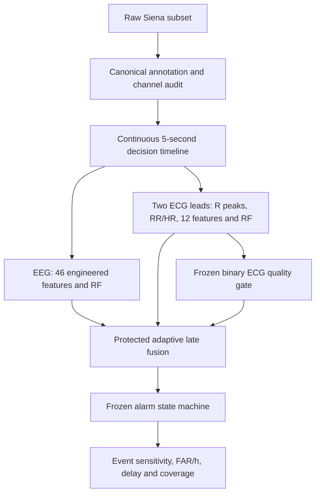

# Multimodal EEG–ECG Seizure Detection with Strict Continuous Evaluation

This retrospective research prototype investigates whether ECG adds useful information to a patient-specific EEG seizure detector on the Siena Scalp EEG Database. It combines engineered EEG features, dual-lead ECG rhythm analysis and quality-gated fusion, with nested whole-recording holdouts and continuous event-level evaluation. Incremental value is tested rather than assumed.

**Study status: FROZEN.** Phase 1–4 are complete. The current ECG representation did **not** demonstrate reliable incremental value. No further pilot tuning or Phase 5 is planned.

## Why this project exists

Overlapping-window classification scores can obscure missed seizures, repeated false declarations and unusable recording time. Randomly splitting adjacent windows also allows information from the same recording into training and evaluation. This project instead measures what a detector declares over complete unseen parent recordings.

## Dataset

The verified pilot comprises **5 patients, 22 eligible parent EDFs, 27 seizures and 59.91 h of eligible recordings**. The local source subset contains 23 EDFs and 28 source events; the entire PN00-3 parent is quarantined because its source seizure offset is outside the recording. All **31/31 targeted source files** pass SHA-256 verification. Canonical tables retain annotation disagreements and uncertainty rather than silently resolving them.

Obtain the data from the original [Siena Scalp EEG Database v1.0.0 on PhysioNet](https://physionet.org/content/siena-scalp-eeg/1.0.0/). The source identifies its file license as [CC BY 4.0](https://physionet.org/content/siena-scalp-eeg/view-license/1.0.0/); retain the downloaded license and attribution. Raw recordings are not included in this repository or its presentation artifacts. Dataset licensing is separate from this repository's software license. Project source code is released under the [MIT License](LICENSE); Siena/PhysioNet data remain governed by their original CC BY 4.0 terms.

## Pipeline



The diagram is Figure 1. EEG uses trailing 10-second windows; ECG uses trailing 60-second windows and a past-only personal reference. RF outputs are **scores**, not calibrated probabilities. ECG processing is decision-causal within retrospective windows, not a validated streaming implementation.

## Evaluation safeguards

- Patient-specific outer holdout of one complete parent EDF; multi-seizure parents remain indivisible. No random window split.
- Inner parent-held scores select thresholds and fusion strength using training recordings only; no outer-test tuning.
- Training-only imputation; peri-ictal training exclusion does not remove continuous evaluation time.
- Canonical uncertainty intervals remain explicit and interrupt alarm state.
- Strict detection requires a new declaration within `[onset, offset)`; duplicates count as unmatched declarations in FAR.
- EEG determines availability. With unavailable ECG, both the EEG score and EEG threshold are used. Alpha=0 and complete ECG outage reproduce EEG alarms exactly. Local gate transitions retain the existing alarm state.
- Frozen configs, dependency hashes, artifact manifests and read-only replay scripts support auditability.

## Main results

<!-- frozen-results:start -->
| System | Detected | Sensitivity | False declarations | FAR/h | Median delay |
|---|---:|---:|---:|---:|---:|
| EEG RF | 13/27 | 48.15% | 69 | 1.154 | 22 s |
| ECG RF | 4/27 | 14.81% | 7 | 0.125 | 40.5 s |
| Fixed late fusion (F1) | 11/27 | 40.74% | 89 | 1.488 | 33 s |
| Adaptive late fusion (F2; primary) | 13/27 | 48.15% | 68 | 1.137 | 22 s |
| Early fusion (F3) | 11/27 | 40.74% | 95 | 1.588 | 18 s* |
<!-- frozen-results:end -->

*Detected-event set differs; this is not evidence of faster detection.*

EEG and all fusion systems have **59.81 h** evaluable exposure and **99.83%** recording coverage. ECG has **56.17 h** evaluable exposure; its FAR therefore has a different denominator. All sensitivities retain the same 27-event denominator.

Adaptive fusion preserved **12** EEG detections, rescued **1**, lost **1**, and still missed **13** events. The net change was only **69→68** false declarations, or **1.45%** lower FAR. The unchanged total sensitivity conceals a lost seizure and event-specific delay penalties.


## Key findings and failure cases

1. EEG behavior is strongly patient- and recording-dependent. PN10-1 contributes **53/69** EEG false declarations and has only about **5.08%** ECG coverage; its F2 fold selects alpha=0 and retains all 53 declarations.
2. Cardiac responses are heterogeneous. ECG-only detects four PN12 events, all already detected by EEG, and rescues no EEG misses.
3. Fixed and early fusion harm the operating point. In primary adaptive fusion, low ECG evidence suppresses the true EEG detection of **PN06-1**.
4. Protected adaptive fusion avoids most degradation but has no stable net improvement: **PN10-9** is rescued while its parent gains two false declarations; **PN12-4** incurs 15 seconds of additional delay.

Absence of a strong cardiac response is not reliable negative evidence against seizure. These findings concern this representation and pilot, not all ECG signals or multimodal methods.

See the [final technical summary](docs/FINAL_PROJECT_SUMMARY.md) for physiology, event fates, patient heterogeneity and failure figures, and the [repository audit](docs/FINAL_REPOSITORY_AUDIT.md) for release checks.

## Reproduction: verify first

The accepted environment is **CPython 3.11.9**, NumPy 2.4.6, SciPy 1.17.1, pandas 3.0.6, scikit-learn 1.9.1 and pyEDFlib 0.1.42. Exact observed runtime/test dependencies are in `requirements-frozen.txt`; `pyproject.toml` retains its original broad package metadata. No core dependency was upgraded during closeout.

From the project root, using a Python 3.11.9 interpreter:

```powershell
python -m venv .venv
.\.venv\Scripts\python.exe -m pip install -r requirements-frozen.txt
```

On POSIX systems use `.venv/bin/python` in place of `.\.venv\Scripts\python.exe`. Direct script execution and pytest use the local source tree; an editable install is unnecessary.

Place the five selected patient directories and source metadata here:

```text
data/raw/siena-scalp-eeg-1.0.0/
  LICENSE.txt
  RECORDS
  SHA256SUMS.txt
  subject_info.csv
  PN00/  PN06/  PN10/  PN12/  PN14/
    *.edf
    Seizures-list-PNxx.txt
```

The existing `scripts/download_siena_subset.py` obtains the selected subset and checksum manifest from the source. Downloading requires roughly 9.9 GB of storage and is separate from verification; no download runs in CI. The source verifier hashes the 31 target files against `SHA256SUMS.txt`. The canonical verifier additionally checks annotation/header evidence, sizes, table hashes and metadata implementation hashes.

```powershell
.\.venv\Scripts\python.exe verify_siena_subset.py
.\.venv\Scripts\python.exe -c "from src.multimodal_seizure.provenance import metadata_identity; print(metadata_identity())"
.\.venv\Scripts\python.exe -m pytest -q -p no:cacheprovider
.\.venv\Scripts\python.exe verify_phase2_eeg.py results/phase2_eeg/3ba65f49586b
.\.venv\Scripts\python.exe verify_phase3_ecg.py results/phase3_ecg/6813d261b922
.\.venv\Scripts\python.exe verify_phase4_fusion.py results/phase4_fusion/ae451eb41426
```

These verifiers require the local raw subset and **all** frozen dependencies, including feature/score CSVs and sidecars. Keep the full frozen result directories together. Phase 2–4 runners remain available, but verification does not require retraining; do not rebuild canonical metadata or rerun production experiments over the frozen release. Code, environment or input changes can produce a different identity rather than reproduce this release.

`.gitattributes` disables line-ending normalization because accepted hashes cover exact file bytes. Do not format frozen code or CSVs. Full identities are in [PROJECT_STATUS.md](PROJECT_STATUS.md).

### Tests and CI

Closeout verification: **74 passed, 0 failed**, including 14 fusion-specific cases. The full suite includes real-data tests and requires the local subset. Unit fixtures fit small synthetic models; no production model is trained during verification.

The workflow in `.github/workflows/tests.yml` selects only synthetic and isolated-provenance tests and downloads neither EDFs nor secrets. Hosted GitHub Actions completed successfully on Ubuntu with Python 3.11.9: **53 passed, 4 deselected**. The same selection also passed locally in source-only copies without raw data.

### Rebuild presentation figures only

```powershell
.\.venv\Scripts\python.exe -m pip install -r requirements-figures.txt
.\.venv\Scripts\python.exe generate_final_figures.py
.\.venv\Scripts\python.exe generate_final_figures.py --check-docs
```

The deterministic generator reads hash-checked frozen CSVs only, never imports model code, and writes four PNG/SVG figures plus `docs/figures/figure_manifest.json`. It requires no raw signals. `--check-docs` checks both displayed result tables against frozen CSVs without generating figures. Figure 1 is the Mermaid pipeline above.

## Repository architecture

```text
README.md / STUDY_PROTOCOL.md / PROJECT_STATUS.md
requirements-frozen.txt / requirements-figures.txt / pyproject.toml
run_phase{2_eeg,3_ecg,4_fusion}.py     Frozen experiment producers
verify_phase{2_eeg,3_ecg,4_fusion}.py  Read-only reconstruction
src/multimodal_seizure/              Canonical data, features, models, alarms
metadata/canonical_*                Authoritative audited metadata
results/phase{2_eeg,3_ecg,4_fusion}/  Full frozen evidence and sidecars
tests/                              Synthetic and local data-dependent checks
docs/FINAL_PROJECT_SUMMARY.md        Definitive scientific narrative
docs/FINAL_REPOSITORY_AUDIT.md        Engineering closeout and limitations
docs/figures/                       Presentation only
```

The 13 legacy outputs listed in `metadata/canonical_manifest.json` remain at their original paths because the frozen Phase 2 verifier checks their historical hashes. They are release-required preservation evidence, **not current model inputs or results**. Two unreferenced header audit CSVs remain locally ignored. Earlier audit/planning documents are explicitly marked historical; they do not define current results or future work.

## Limitations

This is a five-patient, 27-seizure, patient-specific retrospective pilot, with no clinical validation or claim of deployability. All selected EDFs are seizure-bearing recordings, not a large independent seizure-free cohort. Recording and ECG quality vary substantially, with extreme ECG limitation in PN10-1. There are no manual beat-level annotations, no validated streaming device implementation and no external untouched confirmation cohort in this release. Findings do not generalize automatically to other seizure populations and do not establish universal absence of ECG utility.

## Final conclusion

Current compact rhythm-based ECG features did not demonstrate reliable incremental value over the patient-specific EEG detector under strict whole-record continuous evaluation. Fixed and early fusion degraded performance, while protected adaptive late fusion avoided most degradation but produced no stable net improvement.

Phase 1–4 remain frozen. No post-hoc tuning was performed after final evaluation.

## License

Project source code is licensed under the [MIT License](LICENSE). The Siena Scalp EEG dataset is not redistributed here and remains subject to its original PhysioNet/CC BY 4.0 terms.
