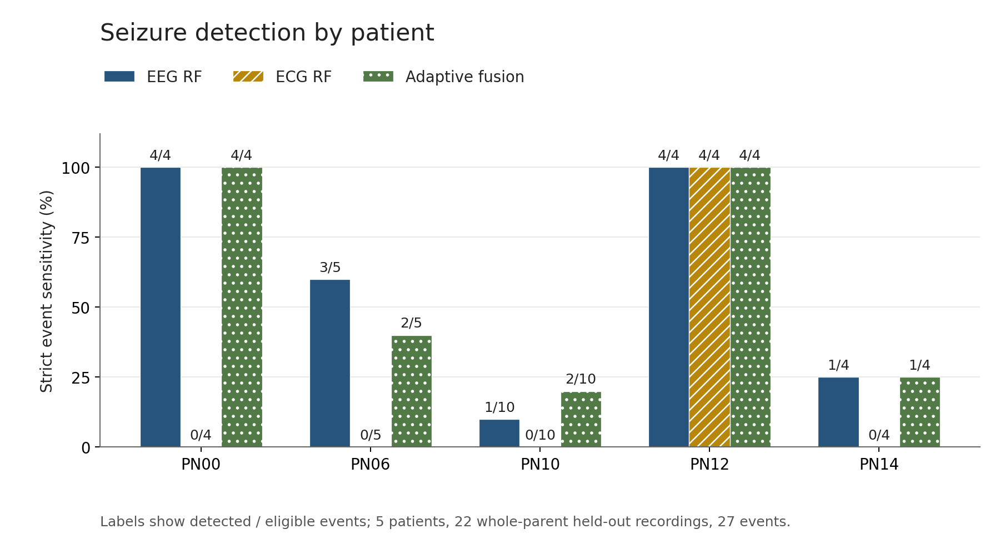
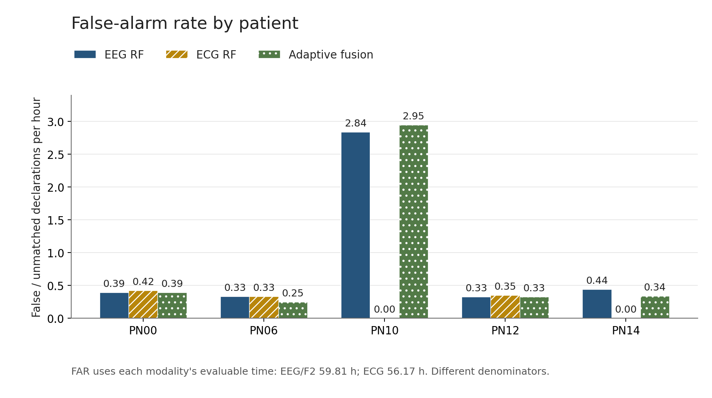
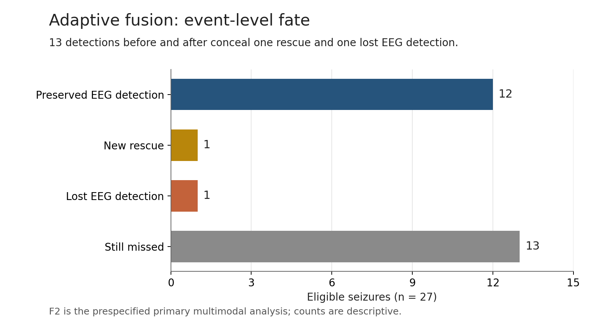
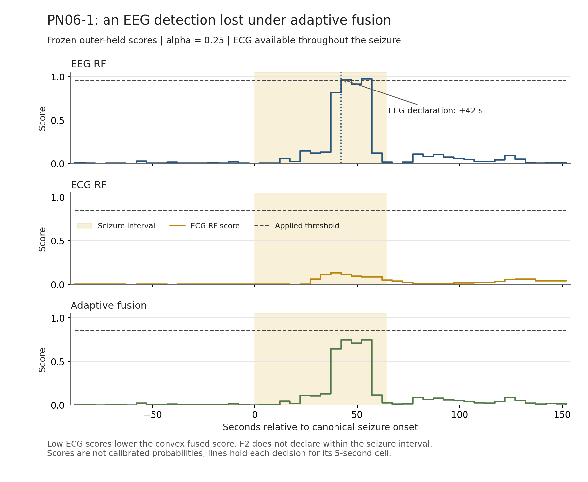

# Final project summary: strict continuous EEG–ECG evaluation

**Status: Phase 1–4 complete and frozen.** This is the definitive account of the five-patient Siena pilot. Earlier research plans and pre-canonical outputs are retained as historical evidence, not current findings.

The study did not demonstrate reliable incremental value from its compact ECG representation. Adaptive fusion retained the same total detection count as EEG, but exchanged one lost EEG detection for one rescue, reduced false declarations by only one, and added event-specific delay. Fixed and early fusion performed worse.

## 1. Research question

Can quality-qualified ECG information improve a patient-specific EEG detector on unseen complete parent recordings, preserving EEG detection and availability while reducing alarm burden without meaningful delay? The study did not assume that multimodal fusion must improve performance. F2 protected adaptive late fusion was the primary multimodal analysis; F1 fixed fusion and F3 early fusion remained secondary after evaluation.

## 2. Dataset and canonical audit

Source: [Siena Scalp EEG Database v1.0.0](https://physionet.org/content/siena-scalp-eeg/1.0.0/), Detti (2020), [DOI 10.13026/5d4a-j060](https://doi.org/10.13026/5d4a-j060). The source specifies CC BY 4.0 for its files. Users obtain recordings, annotations, checksums and license directly from PhysioNet; raw EDFs are excluded from publication here.

The downloaded subset contains 23 EDFs and 28 source seizures across PN00, PN06, PN10, PN12 and PN14. Full source SHA-256 verification passes 31/31 target files. Quarantining PN00-3 leaves **22 eligible parents, 27 events and 215,678 seconds (59.9106 h)**. All selected parents are seizure-bearing recordings.

Official per-patient channel numbers govern modality identity, checked against every EDF header. The EEG sets contain 29 official channels except PN10's 19; ECG uses exactly two official leads. Extra raw channels are excluded. The alias from official channel label `1` to EDF `EEG O1` is explicit. Canonical event, recording and channel tables are separate from historical audits.

## 3. Annotation policies

| Issue | Frozen treatment |
|---|---|
| PN00-3 | Source offset 4,425 s lies beyond the 2,509-second EDF. The proposed 825-second correction is unverified. Canonical offset remains unset; the whole parent, including background, is quarantined. |
| PN14-3 | EDF-header alignment gives `[6740,6781)` s. Source/header registration clocks differ by 10,800 s; both are preserved. |
| PN10-2 | Primary offset 7,828 s; alternative 7,849 s retained; `[7828,7849)` is uncertain. |
| PN10-3 | Clinical onset 7,835 s retained; electrographic onset 7,841 s preserved; `[7835,7841)` is uncertain. |
| PN10-6 | Clinical-only annotation remains clinical-only. |
| Recording end clocks | Ten source ends are 20 s shorter than sample-derived duration; both remain recorded, with sample duration governing bounds. |

Event intervals are half-open. Uncertain intervals override ordinary labels and are removed from exposure rather than counted as normal background. No closeout annotation changes were made.

## 4. Continuous evaluation protocol

Outer validation holds out an entire parent EDF within each patient. Inner validation holds out one outer-training parent at a time. Multi-seizure parents remain indivisible. Imputation, LR scaling, threshold selection and fusion selection use training-side data only. No random-window train/test split or outer-driven model selection is used.

Decisions occur every 5 seconds, starting at 10 seconds for EEG. Negative training windows use a 300-second peri-ictal exclusion; continuous evaluation retains the surrounding background. Thresholds are `.05,.10,...,.95,1.01`. Standard selection maximizes event sensitivity subject to FAR ≤1/h, then prefers lower FAR, lower detected-event median delay and higher threshold.

The frozen alarm machine opens on the first high decision, bridges one low and closes on the second consecutive low. There is no additional smoothing, refractory period or backdating. Missing decisions, sensor unavailability and annotation/acquisition gaps interrupt state. A strict detection requires a new declaration inside `[onset,offset)`; an alarm already active before onset does not count. Duplicates are unmatched declarations in primary FAR.

Exposure is the union of valid decision cells, clipped to recording duration, minus uncertainty/gaps. All primary sensitivities retain 27 events; unavailable ECG does not remove events from that denominator. Delay summarizes detected events and therefore changes its population when a model loses or gains events.

## 5. EEG baseline

Trailing 10-second EEG windows yield 46 compact temporal, spectral and channel-synchrony features. Fixed LR and RF models were evaluated; E1 RF is the frozen comparator. RF uses 300 trees, depth 6, minimum leaf size 5, square-root feature sampling, balanced class weights and seed 20260922. Missing features are filled using training-side medians.

E1 RF detects 13/27 with 69 false declarations over 59.81 evaluable hours. PN10-1 alone supplies 53 of those declarations. This strong recording heterogeneity is not hidden by pooled window metrics. LR was retained as a secondary baseline rather than tuned after observing RF results.

## 6. ECG processing and signal quality

Each decision analyzes only its trailing 60-second support. A forward 5–25 Hz filter, derivative-energy integration, robust candidate threshold, peak refinement and 0.30-second refractory separation produce beat candidates. Invalid RR intervals are retained with masks; RMSSD uses originally adjacent valid pairs rather than bridging removed intervals. HR trend uses actual RR timestamps.

The frozen engineering gates check finite samples, signal amplitude, rail saturation, sufficient valid RR intervals, plausible RR range, temporal coverage and peak contrast. One usable lead can be selected alone; two usable leads must agree in rate and beat timing, then deterministic quality ordering chooses a lead. Both-poor or grossly disagreeing leads are unavailable. These heuristics do not establish clinical rhythm normality.

The 12 predictors are median/mean HR, median/mean RR, HR slope, early-to-late HR difference, RR standard deviation, RMSSD, RR coefficient of variation, relative HR delta, relative HR ratio and relative RR delta. No morphology bank, LF/HF or quality metadata enters the model.

The personal reference spans `[t-360,t-60)` using five disjoint historical 60-second blocks. At least two good blocks are required; otherwise relative features remain missing while absolute ECG detection may remain available. No future reference samples are used. However, overlapping retrospective windows can revise beat estimates: this is decision-causal window processing, not validated sample-by-sample streaming QRS.

## 7. ECG physiological findings — descriptive

Twenty-six of 27 events satisfy the frozen physiological analyzability rule; PN10-1 does not. Trailing-window HR summaries include pre-onset samples, so the following are not isolated instantaneous ictal heart rates.

| Patient | Analyzable events | Positive HR delta* | Median HR delta, bpm |
|---|---:|---:|---:|
| PN00 | 4/4 | 2/4 | +0.06 |
| PN06 | 5/5 | 4/5 | +3.06 |
| PN10 | 9/10 | 2/9 | −2.33 |
| PN12 | 4/4 | 4/4 | +4.87 |
| PN14 | 4/4 | 3/4 | +1.37 |

*A positive sign only, not a tuned responder classification.* Values come from the frozen Phase 3 `cardiac_patient_summary.csv`. ECG quality and cardiac-response heterogeneity are descriptive observations, not outer-test rules used to configure fusion. No manual beat-level ground truth establishes detector accuracy.

## 8. Fusion designs

- **F0:** frozen-style EEG RF, with threshold, alarms and metrics checked against Phase 2.
- **F1:** fixed alpha=.5 late fusion, threshold selected on inner data.
- **F2, primary:** alpha in `{0,.1,.25,.5}` selected jointly with threshold using inner OOF continuous event metrics.
- **F3:** one RF with the same capacity on 46 EEG plus 12 ECG features; unavailable ECG predictors are missing, never a reason to discard an available EEG row. Imputation uses training parents only.

For late fusion, `sF=(1-alpha*q)*sE+alpha*q*sC`, where q is frozen binary ECG availability with a finite ECG model score. EEG defines system availability. The accepted pre-evaluation clarification applies threshold fallback as well: q=0 uses the EEG threshold, q=1 uses the fusion threshold, and alpha=0 always uses EEG. The evaluator's alarm semantics are unchanged; local gate transitions retain state. Complete ECG outage exactly reproduces EEG.

Nonzero F2 candidates must preserve inner sensitivity and coverage, not increase FAR, improve sensitivity or FAR strictly, and increase median paired delay on jointly detected events by at most 5 seconds. If there are no jointly detected events, this delay condition is undefined and vacuous, not positive evidence of latency protection. Eligible ties prefer higher sensitivity, lower FAR, lower median delay, smaller alpha and higher threshold. Otherwise alpha=0 is selected.

F2 selects alpha **0/.1/.25/.5 in 15/0/5/2** outer parents. ECG is usable during 93.912% of EEG-evaluable time, but actually contributes during only 45.767% because many folds select alpha=0. No learned SQI or patient-specific handcrafted rule was added.

## 9. Main quantitative results — primary operating evidence

<!-- frozen-results:start -->
| System | Detected | Sensitivity | False declarations | FAR/h | Median delay |
|---|---:|---:|---:|---:|---:|
| EEG RF | 13/27 | 48.15% | 69 | 1.154 | 22 s |
| ECG RF | 4/27 | 14.81% | 7 | 0.125 | 40.5 s |
| Fixed late fusion (F1) | 11/27 | 40.74% | 89 | 1.488 | 33 s |
| Adaptive late fusion (F2; primary) | 13/27 | 48.15% | 68 | 1.137 | 22 s |
| Early fusion (F3) | 11/27 | 40.74% | 95 | 1.588 | 18 s* |
<!-- frozen-results:end -->

*Detected-event set differs; this is not evidence of faster detection.*

EEG/F1/F2/F3 exposure is 215,316 s (59.81 h), corresponding to 99.832% of eligible recording time. ECG exposure is 202,222 s (56.1728 h), or 93.761%; compare FAR with these different denominators in mind. ECG-unavailable events remain in the 27-event sensitivity denominator.

| Patient | EEG detected | ECG detected | F2 detected | EEG false declarations | ECG false declarations | F2 false declarations |
|---|---:|---:|---:|---:|---:|---:|
| PN00 | 4/4 | 0/4 | 4/4 | 1 | 1 | 1 |
| PN06 | 3/5 | 0/5 | 2/5 | 4 | 4 | 3 |
| PN10 | 1/10 | 0/10 | 2/10 | 53 | 0 | 55 |
| PN12 | 4/4 | 4/4 | 4/4 | 2 | 2 | 2 |
| PN14 | 1/4 | 0/4 | 1/4 | 9 | 0 | 7 |

F2 changes warning time from 1,280 to 1,255 seconds, and warning fraction from 0.594% to 0.583%; the longest alarm stays 60 seconds. Coverage is identical in every parent. Pooled values are descriptive; the independent units are patients, parents and seizures, not approximately 43,000 independent windows. No significance claim or post-hoc statistical search was made.

## 10. Event-level complementarity

Before fusion, EEG/ECG complementarity is **both 4, EEG-only 9, ECG-only 0, neither 14**. All ECG-only-model detections are PN12 events already detected by EEG.

F2 relative to EEG gives **preserved 12, rescued 1, lost 1, still missed 13**. PN06-1 is lost; PN10-9 is rescued at +12 s. PN12-4 changes from +18 to +33 s; PN14-3 changes from +30 to +35 s. The pooled median remains 22 s despite these penalties.

The full 27-event comparison and all parent-level differences remain in the frozen Phase 4 `event_comparison.csv` and `paired_comparison.csv`.

## 11. False-alarm analysis — descriptive

Of 69 original EEG false declarations, F2 preserves 63 at the same time and suppresses 6; it adds 5 new declarations, giving a net reduction of one. The prespecified one-to-one diagnostic finds zero shifted or overlapping replacement matches. The classification is a matching convention, not proof of a physiological mechanism.

At the original EEG false-declaration times, ECG is unavailable for 52 and available for 17. PN10-1 retains all 53 of its original false declarations, including 52 occurring during unavailable ECG. Its outer alpha is zero. Overall F2 FAR changes only from 1.154 to 1.137/h (−1.45%).

## 12. Failure mechanisms and their limits

- **PN10-1:** extreme ECG availability limitation and recording heterogeneity; the available 5.08% cannot characterize physiology throughout the recording. F2 cannot repair its main EEG failure with the current ECG path.
- **PN06-1:** ECG is quality-qualified, but its score lowers the convex fused score enough to suppress the true EEG declaration at +42 s. Good signal quality does not guarantee useful seizure evidence.
- **PN10-9:** one rescue occurs in PN10-7.8.9, alongside two additional false declarations in that parent. This is not an isolated net improvement.
- **PN12-4:** fusion adds 15 seconds of delay despite inner protection. Training-side constraints do not guarantee outer preservation.

This plot uses the saved outer EEG, ECG and F2 scores, applied thresholds and frozen seizure interval only. RF score behavior demonstrates an algorithmic failure; it does not establish autonomic causation or clinical absence of a cardiac response.

## 13. What did not work

Fixed .5 fusion reduces detection from 13 to 11 and increases false declarations from 69 to 89. Early RF fusion also detects 11, with 95 false declarations. Neither is an improvement. Protected adaptive fusion selects alpha=0 in 15/22 parents and fails to provide a stable advantage across patients.

No alternative primary model was selected after seeing these outcomes. No denser alpha grid, stronger EEG architecture, learned gate, morphology expansion, seed sweep or later confirmation cohort was introduced.

## 14. Scientific interpretation

Absence of a strong cardiac response is not reliable negative evidence against seizure. With these features and models, convex fusion can suppress EEG false positives but also suppress true EEG detections. Quality gating protects against unavailable ECG; it does not make every quality-qualified cardiac score informative. This is an interpretation of the observed algorithmic behavior, not a universal biological claim.

## 15. Limitations

- Small pilot: five patients and only 27 eligible seizures; patient-specific rather than cross-patient deployment.
- All selected EDFs are seizure-bearing recordings, not a large independent seizure-free cohort.
- Recording, montage and ECG-quality heterogeneity; especially PN10-1's extreme ECG limitation.
- Annotation disagreements are preserved; quarantine and uncertainty do not replace expert adjudication.
- No manual beat-level annotations; plausible RR/HR and repeatability do not establish beat accuracy.
- Retrospective forward-window ECG analysis, not validated device streaming or clinical real-time detection.
- No external untouched confirmation cohort, clinical validation, calibrated risk scores or patient-safety claim.
- No inference that ECG is universally unhelpful or that all multimodal seizure detection fails.

## 16. Reproducibility and provenance

Use the verification-first commands in [README.md](../README.md). The accepted core environment is CPython 3.11.9, NumPy 2.4.6, SciPy 1.17.1, pandas 3.0.6, scikit-learn 1.9.1 and pyEDFlib 0.1.42. The full suite passes 74 tests. Phase 2/3 replays each cover 44 model-folds; Phase 4 covers 88 model-folds, 22 inner selections, 27 event comparisons, 69 false-alarm fates and 66 exact-fallback controls.

All identities are listed in [PROJECT_STATUS.md](../PROJECT_STATUS.md). Accepted metadata, producer code, result bytes and sidecars remain unchanged. The 13 pre-canonical files named by the canonical manifest must accompany the release because the frozen Phase 2 replay verifies their preservation; they are historical evidence only. Source EDFs remain separately obtained and ignored. New figures have their own source/output hash manifest and do not create a scientific experiment identity.

The final [engineering audit](FINAL_REPOSITORY_AUDIT.md) records the initialized local Git repository, staged release checks, hosted-CI status, dependencies, publication boundary and remaining limitations.

## 17. Final conclusion

In this five-patient Siena pilot, compact rhythm-based ECG features showed heterogeneous seizure-associated responses and did not provide reliable incremental value over a patient-specific EEG detector under strict whole-recording continuous evaluation. Fixed and early fusion degraded performance, while protected adaptive late fusion avoided most degradation but produced no stable net improvement.

The study is complete. No Phase 5 or further pilot tuning is planned.

## Portfolio summary

Developed a leakage-resistant multimodal EEG–ECG seizure-detection pipeline on the Siena Scalp EEG Database using whole-record held-out validation and continuous event-level metrics. Built engineered EEG models, dual-lead ECG R-peak/RR/HR analysis, signal-quality gating, past-only personal baselines and protected adaptive fusion. Across 5 patients, 22 recordings and approximately 60 h of data, failure analysis showed heterogeneous cardiac responses and no stable incremental gain from ECG fusion, highlighting the need for explicit quality handling, fallback logic and event-level validation. The system is a retrospective research prototype.

### Optional CV bullets

- Built engineered EEG and dual-lead ECG rhythm-processing pipelines for a five-patient, 22-recording Siena pilot, with explicit annotation and signal-quality audits.
- Implemented nested whole-parent validation, continuous alarm/event metrics, immutable provenance and regression tests protecting against leakage and missing-modality failures.
- Evaluated fixed, protected adaptive and early EEG–ECG fusion; documented a negative incremental-value result through paired event, false-alarm and latency analysis.
